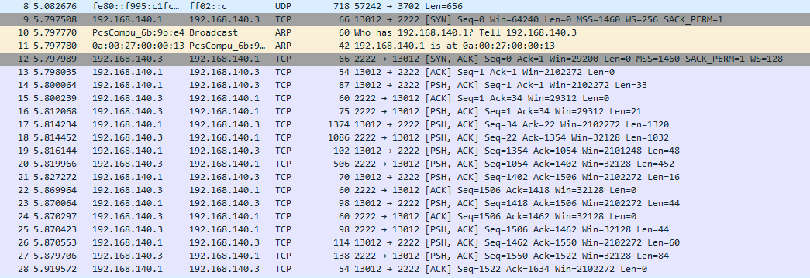
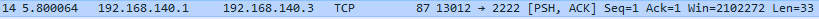

# TP1 - Back to Basics

## I.Gather Informations

* Liste des cartes réseaux :
    ```
    [sote@localhost ~]$ ip a
        1: lo: <LOOPBACK,UP,LOWER_UP> mtu 65536 qdisc noqueue state UNKNOWN group default qlen 1000
            link/loopback 00:00:00:00:00:00 brd 00:00:00:00:00:00
            inet 127.0.0.1/8 scope host lo
                valid_lft forever preferred_lft forever
            inet6 ::1/128 scope host
                valid_lft forever preferred_lft forever
        2: enp0s3: <BROADCAST,MULTICAST,UP,LOWER_UP> mtu 1500 qdisc fq_codel state UP group default qlen 1000
            link/ether 08:00:27:2e:1b:a3 brd ff:ff:ff:ff:ff:ff
            inet 10.0.2.15/24 brd 10.0.2.255 scope global dynamic noprefixroute enp0s3
                valid_lft 85836sec preferred_lft 85836sec
            inet6 fe80::f9ba:9cc:b82f:350e/64 scope link noprefixroute
                valid_lft forever preferred_lft forever
        3: enp0s8: <BROADCAST,MULTICAST,UP,LOWER_UP> mtu 1500 qdisc fq_codel state UP group default qlen 1000
            link/ether 08:00:27:6b:9b:e4 brd ff:ff:ff:ff:ff:ff
            inet 192.168.140.2/24 brd 192.168.140.255 scope global noprefixroute enp0s8
                valid_lft forever preferred_lft forever
            inet6 fe80::a00:27ff:fe6b:9be4/64 scope link
                valid_lft forever preferred_lft forever
    ```

* Déterminer si les cartes réseau ont récupéré une IP en DHCP :
  * enp0s3 (à internet) : Oui comme le montre le fichier `internal-8c885912-ab77-4838-8846-6a7d444dcb84-enp0s3.lease` dans le dossier `/var/lib/NetworkManager/` avec la commande ci-suivant :
    ```
    [sote@localhost ~]$ sudo cat /var/lib/NetworkManager/     internal-8c885912-ab77-4838-8846-6a7d444dcb84-enp0s3.lease
    *This is private data. Do not parse.*
    ADDRESS=10.0.2.15
    NETMASK=255.255.255.0
    ROUTER=10.0.2.2
    SERVER_ADDRESS=10.0.2.2
    NEXT_SERVER=10.0.2.4
    T1=43200
    T2=75600
    LIFETIME=86400
    DNS=10.33.10.20 10.33.10.2 8.8.8.8 8.8.4.4
    DOMAINNAME=auvence.co
    CLIENTID=010800272e1ba3
    ```
  * enp0s8 (SSH) : L'IP de cette carte réseau est fixe car on peut constater qu'il n'y a pas de bail DHCP via :
        ```
        [sote@localhost ~]$ nmcli con show enp0s8 | grep "dhcp"
        ipv4.dhcp-client-id:                    --
        ipv4.dhcp-timeout:                      0 (default)
        ipv4.dhcp-send-hostname:                yes
        ipv4.dhcp-hostname:                     --
        ipv4.dhcp-fqdn:                         --
        ipv6.dhcp-duid:                         --
        ipv6.dhcp-send-hostname:                yes
        ipv6.dhcp-hostname:                     --
        ```

* Table de routage et table ARP de la machine :
  * Table de routage :
    ```
    [sote@localhost ~]$ ip route
    default via 10.0.2.2 dev enp0s3
    default via 10.0.2.2 dev enp0s3 proto dhcp metric 100
    10.0.2.0/24 dev enp0s3 proto kernel scope link src 10.0.2.15 metric 100
    192.168.140.0/24 dev enp0s8 proto kernel scope link src 192.168.140.2 metric 101
    ```

    La première ligne `default via 10.0.2.2 dev enp0s3 proto dhcp metric 100` signifie que la route par défaut de la carte nommée `enp0s3` est l'adresse IP `10.0.2.2`, et qu'elle est connectée via DHCP (`proto dhcp`).
    La ligne `10.0.2.0/24 dev enp0s3 proto kernel scope link src 10.0.2.15 metric 100` nous indique que la carte `enp0s3` est connectée au réseau `10.0.2.0/24` avec l'adresse `10.0.2.15`.
    La dernière ligne nous montre que la carte nommée `enp0s8` est connectée au réseau `192.168.140.0/24` avec l'adresse `192.168.140.2`.

  * Table ARP :
    ```
    [sote@localhost ~]$ arp
    Address                  HWtype  HWaddress           Flags Mask            Iface
    192.168.140.1            ether   0a:00:27:00:00:14   C                     enp0s8
    _gateway                 ether   52:54:00:12:35:02   C                     enp0s3
    ```

    La première ligne de la table ARP nous montre que la VM a communiqué par l'interface `enp0s3` (donc connais) l'adresse de la machine hôte qui est ici `192.168.140.1` par ethernet `ether` avec l'adresse physique (MAC) `0a:00:27:00:00:14`.
    La seconde ligne nous indique que la VM a communiqué par l'interface `enp0s3` à une machine inconnue via la gateway `_gateway` qui a l'adresse MAC `52:54:00:12:35:02` par ethernet `ether`.

* Liste des ports en écoute :
    ```
    [sote@localhost ~]$ sudo ss -ltupn
    Netid     State       Recv-Q       Send-Q                 Local Address:Port             Peer Address:Port
    udp       UNCONN      0            0                            0.0.0.0:68                    0.0.0.0:*          users:(("dhclient",pid=1670,fd=7))
    udp       UNCONN      0            0                   10.0.2.15%enp0s3:68                    0.0.0.0:*          users:(("NetworkManager",pid=757,fd=18))
    tcp       LISTEN      0            128                          0.0.0.0:22                    0.0.0.0:*          users:(("sshd",pid=772,fd=6))
    tcp       LISTEN      0            128                             [::]:22                       [::]:*          users:(("sshd",pid=772,fd=8))
    ```

    On peut observer que les ports écoutés sont les ports 68 (UDP) et 22 (TCP), on observe donc que les services qui utilisent ces ports sont : le daemon SSH (`SSHD`) sur le port `22`, `dhclient` sur le port 68 ainsi que NetworkManager sur le même port (`68`).

* Serveurs DNS utilisés :
    ```
    [sote@localhost ~]$ cat /etc/resolv.conf
    ; generated by /usr/sbin/dhclient-script
    search auvence.co
    nameserver 10.33.10.20
    nameserver 10.33.10.2
    nameserver 8.8.8.8
    nameserver 8.8.4.4
    ```

    On peut observer qu'il y a 8 serveurs DNS utilisés dont 2 sont à Google (`8.8.8.8` ainsi que `8.8.4.4`), et les deux autres appartienent au réseau dans lequel ma machine est situé (`10.33.10.20` et `10.33.10.2`).

    * Requête à `www.reddit.com` :
        ```
        [sote@localhost ~]$ dig www.reddit.com
        
        ; <<>> DiG 9.11.4-P2-RedHat-9.11.4-17.P2.el8_0.1 <<>> www.reddit.com
        ;; global options: +cmd
        ;; Got answer:
        ;; ->>HEADER<<- opcode: QUERY, status: NOERROR, id: 18404
        ;; flags: qr rd ra; QUERY: 1, ANSWER: 5, AUTHORITY: 13, ADDITIONAL: 27
        
        ;; OPT PSEUDOSECTION:
        ; EDNS: version: 0, flags:; udp: 4096
        ;; QUESTION SECTION:
        ;www.reddit.com.                        IN      A
        
        ;; ANSWER SECTION:
        www.reddit.com.         159     IN      CNAME   reddit.map.fastly.net.
        reddit.map.fastly.net.  29      IN      A       151.101.1.140
        reddit.map.fastly.net.  29      IN      A       151.101.193.140
        reddit.map.fastly.net.  29      IN      A       151.101.129.140
        reddit.map.fastly.net.  29      IN      A       151.101.65.140
        
        ;; AUTHORITY SECTION:
        net.                    163646  IN      NS      i.gtld-servers.net.
        net.                    163646  IN      NS      e.gtld-servers.net.
        net.                    163646  IN      NS      g.gtld-servers.net.
        net.                    163646  IN      NS      f.gtld-servers.net.
        net.                    163646  IN      NS      j.gtld-servers.net.
        net.                    163646  IN      NS      m.gtld-servers.net.
        net.                    163646  IN      NS      a.gtld-servers.net.
        net.                    163646  IN      NS      h.gtld-servers.net.
        net.                    163646  IN      NS      c.gtld-servers.net.
        net.                    163646  IN      NS      l.gtld-servers.net.
        net.                    163646  IN      NS      k.gtld-servers.net.
        net.                    163646  IN      NS      d.gtld-servers.net.
        net.                    163646  IN      NS      b.gtld-servers.net.
        
        ;; ADDITIONAL SECTION:
        a.gtld-servers.net.     163634  IN      A       192.5.6.30
        a.gtld-servers.net.     163634  IN      AAAA    2001:503:a83e::2:30
        m.gtld-servers.net.     163634  IN      A       192.55.83.30
        m.gtld-servers.net.     163634  IN      AAAA    2001:501:b1f9::30
        j.gtld-servers.net.     163634  IN      A       192.48.79.30
        j.gtld-servers.net.     163634  IN      AAAA    2001:502:7094::30
        k.gtld-servers.net.     163634  IN      A       192.52.178.30
        k.gtld-servers.net.     163634  IN      AAAA    2001:503:d2d::30
        f.gtld-servers.net.     163634  IN      A       192.35.51.30
        f.gtld-servers.net.     163634  IN      AAAA    2001:503:d414::30
        c.gtld-servers.net.     163634  IN      A       192.26.92.30
        c.gtld-servers.net.     163634  IN      AAAA    2001:503:83eb::30
        g.gtld-servers.net.     163634  IN      A       192.42.93.30
        g.gtld-servers.net.     163634  IN      AAAA    2001:503:eea3::30
        l.gtld-servers.net.     163634  IN      A       192.41.162.30
        l.gtld-servers.net.     163634  IN      AAAA    2001:500:d937::30
        b.gtld-servers.net.     163634  IN      A       192.33.14.30
        b.gtld-servers.net.     163634  IN      AAAA    2001:503:231d::2:30
        i.gtld-servers.net.     163634  IN      A       192.43.172.30
        i.gtld-servers.net.     163634  IN      AAAA    2001:503:39c1::30
        h.gtld-servers.net.     163634  IN      A       192.54.112.30
        h.gtld-servers.net.     163634  IN      AAAA    2001:502:8cc::30
        e.gtld-servers.net.     163634  IN      A       192.12.94.30
        e.gtld-servers.net.     163634  IN      AAAA    2001:502:1ca1::30
        d.gtld-servers.net.     163634  IN      A       192.31.80.30
        d.gtld-servers.net.     163634  IN      AAAA    2001:500:856e::30
        
        ;; Query time: 48 msec
        ;; SERVER: 10.33.10.20#53(10.33.10.20)
        ;; WHEN: Thu Sep 26 12:58:37 CEST 2019
        ;; MSG SIZE  rcvd: 935
        ```

    * On observe que dans la réponse il y a `;; SERVER: 10.33.10.20#53(10.33.10.20)`, soit l'adresse d'un des serveurs DNS de notre réseau actuel

    * Firewall :
        ```
        [sote@ ~]$systemctl status firewalld
        ● firewalld.service - firewalld - dynamic firewall daemon
            Loaded: loaded (/usr/lib/systemd/system/firewalld.service; enabled; vendor preset: enabled)
            Active: active (running) since Thu 2019-09-26 15:23:15 CEST; 34min ago
                Docs: man:firewalld(1)
        Main PID: 753 (firewalld)
                Tasks: 2 (limit: 11514)
            Memory: 30.8M
            CGroup: /system.slice/firewalld.service
                    └─753 /usr/libexec/platform-python -s /usr/sbin/firewalld --nofork --nopid

        Sep 26 15:23:11 localhost.localdomain systemd[1]: Starting firewalld - dynamic firewall daemon...
        Sep 26 15:23:15 localhost.localdomain systemd[1]: Started firewalld - dynamic firewall daemon.
        ```

        Liste des interfaces filtrées :
            ```
            [sote@ ~]$sudo firewall-cmd --list-interfaces
            enp0s3 enp0s8
            ```

        Aucun port TCP/UDP n'est ouvert/filtré :
            ```
            [sote@ ~]$sudo firewall-cmd --list-ports

            [sote@ ~]$echo $?
            0
            ```

        Afficher les "vraies" rêgles firewall avec nftables :
            Pour voir la config clique [ici](nftables_config.md) (trop long pour être mis la :()

## II.Edit Configuration

### 1.Configuraton cartes réseau

* Modifier la configuration de la carte réseau privée

    Nous avons la carte `enp0s8` avec la configuration ci suivante :
        ```
        [sote@localhost ~]$ cat /etc/sysconfig/network-scripts/ifcfg-enp0s8ipts/ifcfg-enp0s8
        NAME=enp0s8
        DEVICE=enp0s8
        
        ONBOOT=yes
        BOOTPROTO=static
        
        IPADDR=192.168.140.2
        NETMASK=255.255.255.0
        ```

    Qui nous affiche avec `ip a` :
        ```
        [sote@localhost ~]$ sudo ip a | grep enp0s8
        3: enp0s8: <BROADCAST,MULTICAST,UP,LOWER_UP> mtu 1500 qdisc fq_codel state UP groupe
        default qlen 1000
        inet 192.168.140.2/24 brd 192.168.140.255 scope global noprefixroute enp0s8
        ```

    Nous modifions (avec `vi`) le fichier de configuration `ifcfg-enp0s8` afin de donner à la carte `enp0s8` l'adresse `192.168.140.3` :

        ```
        [sote@localhost ~]$ cat /etc/sysconfig/network-scripts/ifcfg-enp0s8ipts/ifcfg-enp0s8
        NAME=enp0s8
        DEVICE=enp0s8
        
        ONBOOT=yes
        BOOTPROTO=static
        
        IPADDR=192.168.140.3
        NETMASK=255.255.255.0
        ```

    Puis nous redémarrons NetworkManger avec la commande `sudo nmcli c reload` puis nous redémarrons l'interface avec `sudo nmcli con up enp0s8` :
    
        ```
        [sote@localhost ~]$ sudo nmcli con up enp0s8
        Connection successfully activated (D-Bus active path: /org/freedesktop/NetworkManager/ActiveConnection/3)
        ```

    Puis nous vérifions que les changements ont été pris en compte avec à nouveau `ip a` :
        
        ```
        [sote@localhost ~]$ sudo ip a | grep enp0s8
        3: enp0s8: <BROADCAST,MULTICAST,UP,LOWER_UP> mtu 1500 qdisc fq_codel state UP groupe
        default qlen 1000
        inet 192.168.140.3/24 brd 192.168.140.255 scope global noprefixroute enp0s8
        ```

* Créer une nouvelle carte réseau :
    Définir une IP statique pour cette nouvelle carte :
        Modification du fichier (toujours avec `vi`) :

            ```
            [sote@localhost ~]$ sudo cat /etc/sysconfig/network-scripts/ifcfg-enp0s9
            NAME=enp0s9
            DEVICE=enp0s9
            
            ONBOOT=yes
            BOOTPROTO=static
            
            IPADDR=192.168.165.2
            NETMASK=255.255.255.0
            ```

        Redémarrage de NetworkManager et la carte `enp0s9` avec `sudo nmcli c reload` :

            ```
            [sote@localhost ~]$ sudo nmcli c reload
            [sote@localhost ~]$ sudo nmcli con up enp0s9
            Connection successfully activated (D-Bus active path: /org/freedesktop/NetworkManager/ActiveConnection/8)
            ```

* Vérifiez vos changements :
    Affichez les nouvelles cartes/IP :

        ```
        [sote@localhost ~]$ ip a
        1: lo: <LOOPBACK,UP,LOWER_UP> mtu 65536 qdisc noqueue state UNKNOWN group default qlen 1000
            link/loopback 00:00:00:00:00:00 brd 00:00:00:00:00:00
            inet 127.0.0.1/8 scope host lo
            valid_lft forever preferred_lft forever
            inet6 ::1/128 scope host
            valid_lft forever preferred_lft forever
            2: enp0s3: <BROADCAST,MULTICAST,UP,LOWER_UP> mtu 1500 qdisc fq_codel state UP group default qlen 1000
            link/ether 08:00:27:2e:1b:a3 brd ff:ff:ff:ff:ff:ff
            inet 10.0.2.15/24 brd 10.0.2.255 scope global dynamic noprefixroute enp0s3
                valid_lft 85880sec preferred_lft 85880sec
            inet6 fe80::f9ba:9cc:b82f:350e/64 scope link noprefixroute
                valid_lft forever preferred_lft forever
        3: enp0s8: <BROADCAST,MULTICAST,UP,LOWER_UP> mtu 1500 qdisc fq_codel state UP group default qlen 1000
            link/ether 08:00:27:6b:9b:e4 brd ff:ff:ff:ff:ff:ff
            inet 192.168.140.3/24 brd 192.168.140.255 scope global noprefixroute enp0s8
                valid_lft forever preferred_lft forever
            inet6 fe80::a00:27ff:fe6b:9be4/64 scope link
                valid_lft forever preferred_lft forever
        4: enp0s9: <BROADCAST,MULTICAST,UP,LOWER_UP> mtu 1500 qdisc fq_codel state UP group default qlen 1000
            link/ether 08:00:27:bc:59:a8 brd ff:ff:ff:ff:ff:ff
            inet 192.168.165.2/24 brd 192.168.165.255 scope global noprefixroute enp0s9
                valid_lft forever preferred_lft forever
            inet6 fe80::a00:27ff:febc:59a8/64 scope link
                valid_lft forever preferred_lft forever
        ```

    Afficher les nouvelles tables ARP/de routage :

        ```
        [sote@localhost ~]$ ip route
        default via 10.0.2.2 dev enp0s3 proto dhcp metric 100
        10.0.2.0/24 dev enp0s3 proto kernel scope link src 10.0.2.15 metric 100
        192.168.140.0/24 dev enp0s8 proto kernel scope link src 192.168.140.3 metric 101
        192.168.165.0/24 dev enp0s9 proto kernel scope link src 192.168.165.2 metric 102
        ```

        On peut voir qu'une ligne concernant enp0s9 et sa configuration est apparue !

### 2.Serveur SSH

* Modifier la configuration du système pour que le serveur SSH tourne sur le port 2222 :
    Afin de modifier le port par lequel le serveur SSH tourne, il suffit d'accéder au fichier de configuration situé dans `/etc/ssh/sshd_config` et de modifier la ligne avec marqué `# Port 22` de base en : `Port 2222`, puis on le redémarre avec `systemctl restart sshd.service`.

    Pour adapter la configuration, on ouvre un port (ici le `2222`) sur le firewall `sudo firewall-cmd --add-port=2222/tcp --permanent`, on retire l'ancien port SSH `sudo firewall-cmd --remove-port=22/tcp --permanent`, puis on relance le firewall avec `sudo firewall-cmd --reload` et finalement on relance le service SSH `sudo systemctl restart sshd.service` puis on vérifie qu'il fonctionne bien, et avec le bon port :

    ```
    [sudo] password for sote:
    ● sshd.service - OpenSSH server daemon
    Loaded: loaded (/usr/lib/systemd/system/sshd.service; enabled; vendor preset: enabled)
    Active: active (running) since Wed 2019-10-02 15:21:52 CEST; 5min ago
        Docs: man:sshd(8)
            man:sshd_config(5)
    Main PID: 9270 (sshd)
        Tasks: 1 (limit: 11514)
        Memory: 1.4M
        CGroup: /system.slice/sshd.service
                └─9270 /usr/sbin/sshd -D -oCiphers=aes256-gcm@openssh.com,chacha20-poly1305@openssh.com,aes256-ctr,aes256>
    
    Oct 02 15:21:52 localhost.localdomain systemd[1]: Stopped OpenSSH server daemon.
    Oct 02 15:21:52 localhost.localdomain systemd[1]: Starting OpenSSH server daemon...
    Oct 02 15:21:52 localhost.localdomain sshd[9270]: Server listening on 0.0.0.0 port 2222.
    Oct 02 15:21:52 localhost.localdomain sshd[9270]: Server listening on :: port 2222.
    Oct 02 15:21:52 localhost.localdomain systemd[1]: Started OpenSSH server daemon.
    ```

* Analyser les trames de connexion au serveur SSH :

    

Sur l'image ci-dessus nous appercevons l'échange entre le serveur SSH et notre client pour la première fois. On peut y voir au début la première étape du "3-way Handshake" qui est le premier "SYNchronized" envoyé par le client au serveur. On observe aussi après qu'il y a le remplissage des tables ARP du client et du serveur avec l'échange de l'adresse MAC de l'un à l'autre. On appercoit ensuite la deuxième partie du Handshake (SYNchronized - ACKnowledge),puis le premier paquet envoyé à la suite est le dernier ACKnowledge du client.

    

## III.Routage simple


