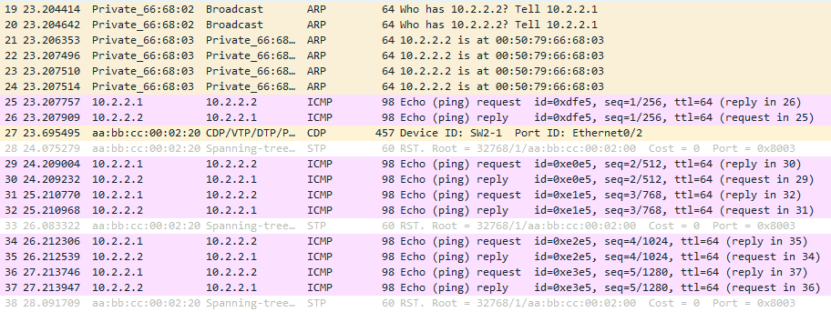
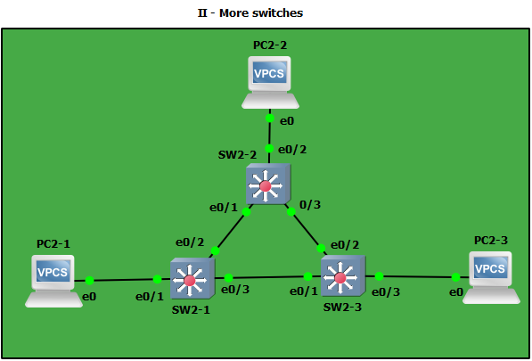
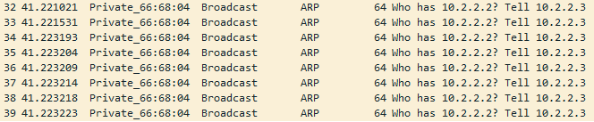
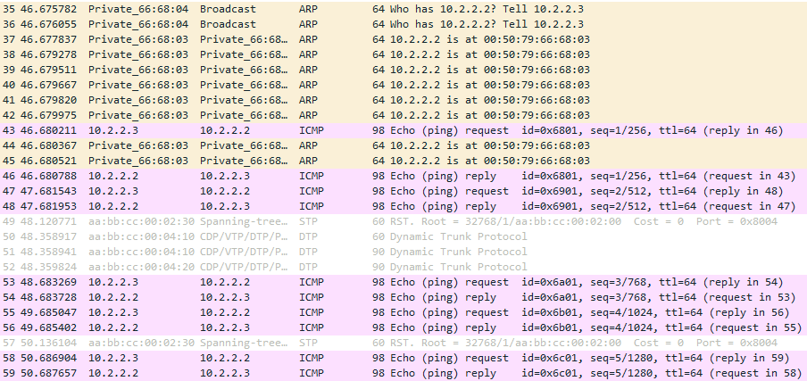
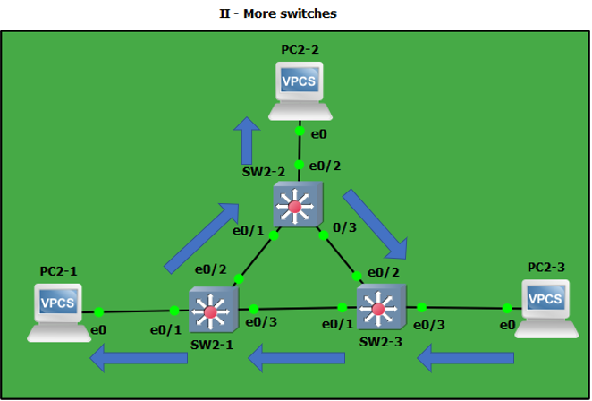
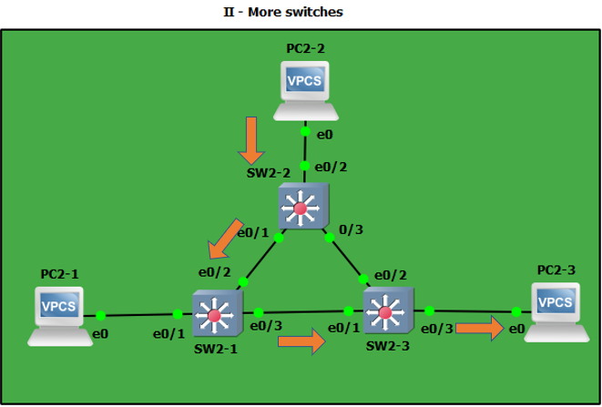
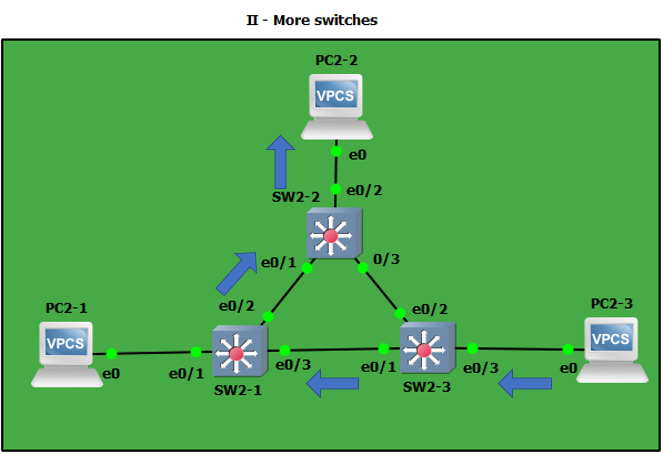

# TP 2 : Network low-level, Switching

## I - Simplest setup

* Mettre en place la topologie :


* Faire communiquer les deux PCs :

Le ping fonctionne :

```
PC1> ping 10.2.1.2
84 bytes from 10.2.1.2 icmp_seq=1 ttl=64 time=0.493 ms
84 bytes from 10.2.1.2 icmp_seq=2 ttl=64 time=0.306 ms
84 bytes from 10.2.1.2 icmp_seq=3 ttl=64 time=0.404 ms
84 bytes from 10.2.1.2 icmp_seq=4 ttl=64 time=0.412 ms
84 bytes from 10.2.1.2 icmp_seq=5 ttl=64 time=0.351 ms
```

dans les deux sens :

```
PC2> ping 10.2.1.1
84 bytes from 10.2.1.1 icmp_seq=1 ttl=64 time=0.252 ms
84 bytes from 10.2.1.1 icmp_seq=2 ttl=64 time=0.651 ms
84 bytes from 10.2.1.1 icmp_seq=3 ttl=64 time=0.586 ms
84 bytes from 10.2.1.1 icmp_seq=4 ttl=64 time=0.303 ms
84 bytes from 10.2.1.1 icmp_seq=5 ttl=64 time=0.486 ms
```


On peut voir ci-dessus que le protocole utilisé par `ping` est le protocole `ICMP` (Internet Control Message Protocol).

L'échange ARP (en jaune) est composé de l'`ARP Request`, ainsi que de deux `ARP Reply`.

Le switch n'a pas besoin d'adresse IP car il sert juste de relais aux informations qui lui sont envoyées.
Par ailleurs, l'adresse IP des machines sert à les identifier dans un réseau.

## II

* Mise en place de la topologie ci-dessus :


* Faire communiquer les 3 PCs :

```
PC1> ping 10.2.2.2
84 bytes from 10.2.2.2 icmp_seq=1 ttl=64 time=0.304 ms
84 bytes from 10.2.2.2 icmp_seq=2 ttl=64 time=0.559 ms
84 bytes from 10.2.2.2 icmp_seq=3 ttl=64 time=0.502 ms
84 bytes from 10.2.2.2 icmp_seq=4 ttl=64 time=0.724 ms
84 bytes from 10.2.2.2 icmp_seq=5 ttl=64 time=0.500 ms
```

```
PC2-2> ping 10.2.2.3
84 bytes from 10.2.2.3 icmp_seq=1 ttl=64 time=0.824 ms
84 bytes from 10.2.2.3 icmp_seq=2 ttl=64 time=0.632 ms
84 bytes from 10.2.2.3 icmp_seq=3 ttl=64 time=0.897 ms
84 bytes from 10.2.2.3 icmp_seq=4 ttl=64 time=0.701 ms
84 bytes from 10.2.2.3 icmp_seq=5 ttl=64 time=0.698 ms
```

```
PC2-3> ping 10.2.2.1
84 bytes from 10.2.2.1 icmp_seq=1 ttl=64 time=0.737 ms
84 bytes from 10.2.2.1 icmp_seq=2 ttl=64 time=0.568 ms
84 bytes from 10.2.2.1 icmp_seq=3 ttl=64 time=0.431 ms
84 bytes from 10.2.2.1 icmp_seq=4 ttl=64 time=0.482 ms
84 bytes from 10.2.2.1 icmp_seq=5 ttl=64 time=0.735 ms
```

* Table MAC du Switch 1 :

```
SW2-1#show mac address-table
          Mac Address Table
-------------------------------------------

Vlan    Mac Address       Type        Ports
----    -----------       --------    -----
   1    0050.7966.6802    DYNAMIC     Et0/1
   1    0050.7966.6804    DYNAMIC     Et0/3
   1    aabb.cc00.0310    DYNAMIC     Et0/2
   1    aabb.cc00.0410    DYNAMIC     Et0/3
   1    aabb.cc00.0420    DYNAMIC     Et0/2
Total Mac Addresses for this criterion: 5
```

- VLAN : VLAN auquel appartient la machine avec laquelle le switch a communiqué. Par défaut, les machines appartiennent au `VLAN 1`.
- Mac Address : Dans cette colonne, on peut voir l'addresse MAC qui a communiqué avec le switch. Elle est notée en `IPv6`
- Type : Il s'agit de la manière dont le Switch a récupéré l'adresse ci-précédente.Il sera `DYNAMIC` si elle a été récupérée lors du broadcast, ou `STATIC` si elle a été définie à la main.
- Ports : Port par lequel le switch a récupéré la précédente adresse MAC.

* Trames CDP :



On peut voir ci-dessus (en plein millieu) la trame CDP. Il s'agit du Cisco Discovery Protocol (CDP) qui est un protocole de découverte de réseau de niveau 2 OSI qui permet de découvrir les autres périphériques directement connectés.

* Informations STP :

- Le Switch `SW2-1` est le root bridge, il n'a donc pas de ports désactivés :

```
SW2-1#show spanning-tree

VLAN0001
  Spanning tree enabled protocol rstp
  Root ID    Priority    32769
             Address     aabb.cc00.0200
             This bridge is the root
             Hello Time   2 sec  Max Age 20 sec  Forward Delay 15 sec
```

- Le root port du switch `SW2-2` est le port `Ethernet0/1` (`e0/1`) :

```
SW2-2#show spanning-tree

VLAN0001
  Spanning tree enabled protocol rstp
  Root ID    Priority    32769
             Address     aabb.cc00.0200
             Cost        100
             Port        2 (Ethernet0/1)
             Hello Time   2 sec  Max Age 20 sec  Forward Delay 15 sec
```
Le port désactivé de ce switch est donc le port `Ethernet0/3` (`e0/3`).

- Le root port du switch `SW2-3` est le port `Ethernet0/1` (`e0/1`) :

```
SW2-3#show spanning-tree

VLAN0001
  Spanning tree enabled protocol rstp
  Root ID    Priority    32769
             Address     aabb.cc00.0200
             Cost        100
             Port        2 (Ethernet0/1)
             Hello Time   2 sec  Max Age 20 sec  Forward Delay 15 sec
```
Le port désactivé de ce switch est donc le port `Ethernet0/2` (`e0/2`).

* El schéma :



|  | SW2-1 | SW2-2 | SW2-3 |
|----------|:----------:|:----------:|:----------:|
| Rôle | `Root Bridge` | Switch | Switch |
| Root Port | X | `e0/1` | `e0/1` |
| Port désactivé | X | X | `e0/2` |

* Confirmer les informations STP :



On peut voir ci-dessus (entre le Switch `SW2-3` et `SW2-2`) qu'il est uniquement émis la requête ARP de notre VPC `VPC2-3`.



Alors que sur cette capture (entre le Switch `SW2-3` et `SW2-1`) on peut voir les requêtes ARP émises en Broadcast par le VPC `VPC2-3`, ainsi que les différentes trames `ping` et `pong` échangées entre `VPC2-3` et `VPC2-2`.

* On peut donc déterminer que le lien qui a été désactivé par STP est celui entre le Switch `SW2-3` et `SW2-2`.

* Schéma trajet ARP quand `VPC2-3` ping `VPC2-2` et la réponse :

Étape 1 : Requête ARP :



Étape 2 : Réponse ARP :



Étape 3 : Requête Ping :



Étape 4 : Réponse Pong :


## III

## IV
