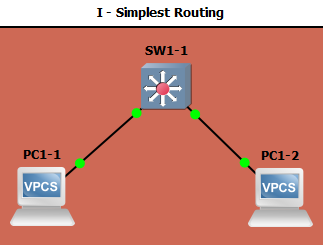

# TP 2 : Network low-level, Switching

## I - Simplest setup

* Mettre en place la topologie :



* Faire communiquer les deux PCs :

Le ping fonctionne :

```
PC1> ping 10.2.1.2
84 bytes from 10.2.1.2 icmp_seq=1 ttl=64 time=0.493 ms
84 bytes from 10.2.1.2 icmp_seq=2 ttl=64 time=0.306 ms
84 bytes from 10.2.1.2 icmp_seq=3 ttl=64 time=0.404 ms
84 bytes from 10.2.1.2 icmp_seq=4 ttl=64 time=0.412 ms
84 bytes from 10.2.1.2 icmp_seq=5 ttl=64 time=0.351 ms
```

dans les deux sens :

```
PC2> ping 10.2.1.1
84 bytes from 10.2.1.1 icmp_seq=1 ttl=64 time=0.252 ms
84 bytes from 10.2.1.1 icmp_seq=2 ttl=64 time=0.651 ms
84 bytes from 10.2.1.1 icmp_seq=3 ttl=64 time=0.586 ms
84 bytes from 10.2.1.1 icmp_seq=4 ttl=64 time=0.303 ms
84 bytes from 10.2.1.1 icmp_seq=5 ttl=64 time=0.486 ms
```


On peut voir ci-dessus que le protocole utilisé par `ping` est le protocole `ICMP` (Internet Control Message Protocol).

L'échange ARP (en jaune) est composé de l'`ARP Request`, ainsi que de deux `ARP Reply`

## II

## III

## IV
