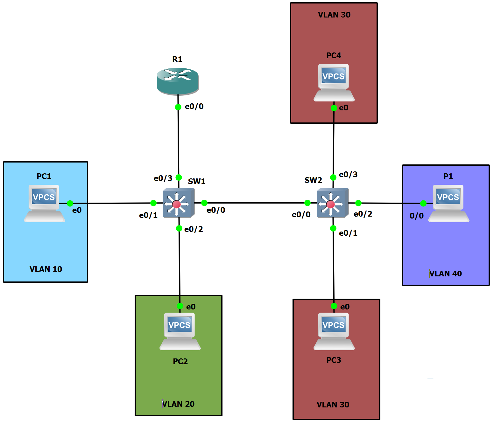

# TP3 - Routage Inter-VLAN + Mise en situation

## I - ROAS (Router On A Stick)

On configure les addresse IP sur chaque VPCs avec `ip 10.3.x0.x/24` (`x` à remplacer selon le tableau d'adressage ci-dessous).

| Machine | VLAN | IP `net1` | IP `net2` | IP `net3` | IP `netP` |
| ------: | :------: | :------: | :------: | :------: | :------: |
| PC1 | 10 | `10.3.10.1/24` | X | X | X |
| PC2 | 20 | X | `10.3.20.2/24` | X | X |
| PC3 | 30 | X | `10.3.20.3/24` | X | X |
| PC4 | 30 | X | X | `10.3.30.4/24` | X |
| P1 | 40 | X | X | X | `10.3.40.1/24` |
| R1 | X | `10.3.10.254/24` | `10.3.20.254/24` | `10.3.30.254/24` | `10.3.40.254/24` |

Pour configurer les différentes adresses IP sur `R1`, on se rend sur le mode configuration du routeur (`conf t`), on set l'interface que l'on va découper en `no shutdown`. Ensuite, on créée/configure chacune des sous-interfaces de l'interface préalablement choisie, ici e0/0, avec `int e0/0.10`, et on applique l'encapsulation `dot1q` pour le VLAN 10 (`encapsulation dot1q 10`) et finalement, on set l'adresse IP de l'interface avec la commande classico-classique : `ip address 10.3.10.254 255.255.255.0`.

Same shit pour les autres VLANs mais avec des adresse adaptées, hein !

## II - Cas Concret

|       | Admins | Users | Stagiaires | Serveurs | Serveurs Sensibles | Imprimantes |
|-------|:------:|:-----:|:----------:|:--------:|:------------------:|:-----------:|
| VLANs | `10`   | `20`  | `30`       | `40`     | `50`               | `60`        |

|          |  Routeur |     Admins     |     Users      |   Stagiaires   |    Serveurs    | Serveurs Sensibles |  Imprimantes   |
|----------|:--------:|:--------------:|:--------------:|:--------------:|:--------------:|:------------------:|:--------------:|
| Réseau : |   Tous.  | `10.3.10.0/24` | `10.3.20.0/24` | `10.3.30.0/24` | `10.3.40.0/24` |   `10.3.50.0/24`   | `10.3.60.0/24` |

|                              | Admins                        | Users                          | Stagiaires                    | Serveurs                      | Serveurs Sensibles            | Imprimantes                   |
|------------------------------|-------------------------------|--------------------------------|-------------------------------|-------------------------------|-------------------------------|-------------------------------|
| Plage d'IP                   | `10.3.10.1/29` `10.3.10.3/29` | `10.3.20.1/27` `10.3.20.16/27` | `10.3.30.1/28` `10.3.30.8/28` | `10.3.40.1/29` `10.3.40.4/29` | `10.3.50.1/29` `10.3.50.2/29` | `10.3.60.1/29` `10.3.60.5/29` |
| Masque réseau                | 255.255.255.248               | 255.255.255.224                | 255.255.255.240               | 255.255.255.248               | 255.255.255.248               | 255.255.255.248               |
| Nbr adresses requis => dispo | 3 => 6                        | 16 => 30                       | 8 => 14                       | 4 => 6                        | 2 => 6                        | 5 => 6                        |
