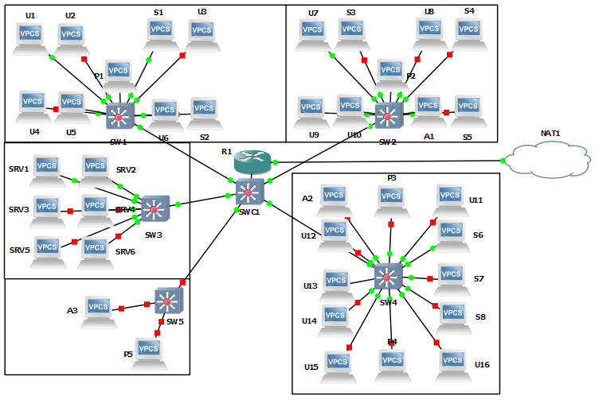

# TP3 - Routage Inter-VLAN + Mise en situation

## I - ROAS (Router On A Stick)


On configure les addresse IP sur chaque VPCs avec `ip 10.3.x0.x/24` (`x` à remplacer selon le tableau d'adressage ci-dessous).

| Machine | VLAN | IP `net1` | IP `net2` | IP `net3` | IP `netP` |
| ------: | :------: | :------: | :------: | :------: | :------: |
| PC1 | 10 | `10.3.10.1/24` | X | X | X |
| PC2 | 20 | X | `10.3.20.2/24` | X | X |
| PC3 | 30 | X | `10.3.20.3/24` | X | X |
| PC4 | 30 | X | X | `10.3.30.4/24` | X |
| P1 | 40 | X | X | X | `10.3.40.1/24` |
| R1 | X | `10.3.10.254/24` | `10.3.20.254/24` | `10.3.30.254/24` | `10.3.40.254/24` |

Pour configurer les différentes adresses IP sur `R1`, on se rend sur le mode configuration du routeur (`conf t`), on set l'interface que l'on va découper en `no shutdown`. Ensuite, on créée/configure chacune des sous-interfaces de l'interface préalablement choisie, ici e0/0, avec `int e0/0.10`, et on applique l'encapsulation `dot1q` pour le VLAN 10 (`encapsulation dot1q 10`) et finalement, on set l'adresse IP de l'interface avec la commande classico-classique : `ip address 10.3.10.254 255.255.255.0`.

Same shit pour les autres VLANs mais avec des adresse adaptées, hein !

Le PC1 (solo) ne peut ping personne :

```
PC1> ping 10.3.20.2                                                                                                     No gateway found                                                                                                                                                                                                                       PC1> ping 10.3.20.3
    No gateway found

PC1> ping 10.3.10.254
    host (10.3.10.254) not reachable
```

Alors que le PC2 peut ping PC3, le routeur, PC4 et P1 :

```
PC2> ping 10.3.20.3                                                                                                  84 bytes from 10.3.20.3 icmp_seq=1 ttl=64 time=0.801 ms                                                              84 bytes from 10.3.20.3 icmp_seq=2 ttl=64 time=1.330 ms                                                              84 bytes from 10.3.20.3 icmp_seq=3 ttl=64 time=0.957 ms                                                              84 bytes from 10.3.20.3 icmp_seq=4 ttl=64 time=1.262 ms                                                              84 bytes from 10.3.20.3 icmp_seq=5 ttl=64 time=0.767 ms                                                                                                                                                                                   PC2> ping 10.3.20.254                                                                                                84 bytes from 10.3.20.254 icmp_seq=1 ttl=255 time=20.524 ms                                                          84 bytes from 10.3.20.254 icmp_seq=2 ttl=255 time=11.077 ms                                                          84 bytes from 10.3.20.254 icmp_seq=3 ttl=255 time=2.090 ms                                                           84 bytes from 10.3.20.254 icmp_seq=4 ttl=255 time=7.549 ms                                                           84 bytes from 10.3.20.254 icmp_seq=5 ttl=255 time=6.205 ms

PC2> ping 10.3.30.4                                                                                                  84 bytes from 10.3.30.4 icmp_seq=1 ttl=63 time=19.746 ms                                                             84 bytes from 10.3.30.4 icmp_seq=2 ttl=63 time=19.639 ms                                                             84 bytes from 10.3.30.4 icmp_seq=3 ttl=63 time=17.781 ms                                                             84 bytes from 10.3.30.4 icmp_seq=4 ttl=63 time=18.140 ms                                                             84 bytes from 10.3.30.4 icmp_seq=5 ttl=63 time=20.713 ms                                                                                                                                                                                  PC2> ping 10.3.40.1                                                                                                  84 bytes from 10.3.40.1 icmp_seq=1 ttl=63 time=14.574 ms                                                             84 bytes from 10.3.40.1 icmp_seq=2 ttl=63 time=18.401 ms                                                             84 bytes from 10.3.40.1 icmp_seq=3 ttl=63 time=13.519 ms                                                             84 bytes from 10.3.40.1 icmp_seq=4 ttl=63 time=11.988 ms                                                             84 bytes from 10.3.40.1 icmp_seq=5 ttl=63 time=20.332 ms
```

Et même chose avec PC3 :

```
PC3> ping 10.3.20.2                                                                                                  84 bytes from 10.3.20.2 icmp_seq=1 ttl=64 time=0.768 ms                                                              84 bytes from 10.3.20.2 icmp_seq=2 ttl=64 time=1.269 ms                                                              84 bytes from 10.3.20.2 icmp_seq=3 ttl=64 time=0.859 ms                                                              84 bytes from 10.3.20.2 icmp_seq=4 ttl=64 time=0.914 ms                                                              84 bytes from 10.3.20.2 icmp_seq=5 ttl=64 time=1.034 ms                                                                                                                                                                                   PC3> ping 10.3.20.254                                                                                                84 bytes from 10.3.20.254 icmp_seq=1 ttl=255 time=9.438 ms                                                           84 bytes from 10.3.20.254 icmp_seq=2 ttl=255 time=2.117 ms                                                           84 bytes from 10.3.20.254 icmp_seq=3 ttl=255 time=7.578 ms                                                           84 bytes from 10.3.20.254 icmp_seq=4 ttl=255 time=7.695 ms                                                           84 bytes from 10.3.20.254 icmp_seq=5 ttl=255 time=4.699 ms

PC3> ping 10.3.30.4                                                                                                  10.3.30.4 icmp_seq=1 timeout                                                                                         84 bytes from 10.3.30.4 icmp_seq=2 ttl=63 time=21.612 ms                                                             84 bytes from 10.3.30.4 icmp_seq=3 ttl=63 time=22.050 ms                                                             84 bytes from 10.3.30.4 icmp_seq=4 ttl=63 time=21.018 ms                                                             84 bytes from 10.3.30.4 icmp_seq=5 ttl=63 time=26.191 ms                                                                                                                                                                                  PC3> ping 10.3.40.1                                                                                                  10.3.40.1 icmp_seq=1 timeout                                                                                         84 bytes from 10.3.40.1 icmp_seq=2 ttl=63 time=20.300 ms                                                            84 bytes from 10.3.40.1 icmp_seq=3 ttl=63 time=14.826 ms                                                             84 bytes from 10.3.40.1 icmp_seq=4 ttl=63 time=15.110 ms                                                             84 bytes from 10.3.40.1 icmp_seq=5 ttl=63 time=16.189 ms
```

## II - Cas Concret

|       | Admins | Users | Stagiaires | Serveurs | Serveurs Sensibles | Imprimantes |
|-------|:------:|:-----:|:----------:|:--------:|:------------------:|:-----------:|
| VLANs | `10`   | `20`  | `30`       | `40`     | `50`               | `60`        |

|        |  Routeur |     Admins     |     Users      |   Stagiaires   |    Serveurs    | Serveurs Sensibles |  Imprimantes   |
|--------|:--------:|:--------------:|:--------------:|:--------------:|:--------------:|:------------------:|:--------------:|
| Réseau |   Tous.  | `10.3.10.0/24` | `10.3.20.0/24` | `10.3.30.0/24` | `10.3.40.0/24` |   `10.3.50.0/24`   | `10.3.60.0/24` |

|                              | Admins                        | Users                          | Stagiaires                    | Serveurs                      | Serveurs Sensibles            | Imprimantes                   |
|------------------------------|-------------------------------|--------------------------------|-------------------------------|-------------------------------|-------------------------------|-------------------------------|
| Plage d'IP                   | `10.3.10.1/29` `10.3.10.3/29` | `10.3.20.1/27` `10.3.20.16/27` | `10.3.30.1/28` `10.3.30.8/28` | `10.3.40.1/28` `10.3.40.4/28` | `10.3.50.1/29` `10.3.50.2/29` | `10.3.60.1/28` `10.3.60.5/28` |
| Masque réseau                | 255.255.255.248               | 255.255.255.224                | 255.255.255.240               | 255.255.255.240               | 255.255.255.248               | 255.255.255.240               |
| Nbr adresses requis => dispo | 4 => 6                        | 17 => 30                       | 9 => 14                       | 5 => 14                       | 2 => 6                        | 6 => 14                       |

On commence par configurer le routeur qui donnera l'accès à internet aux machines (Gateway) :

| Interface |   Adresse IP     |   Réseau    |   Masque          |
|----------:|:----------------:|:-----------:|:-----------------:|
| e0/0.10   | `10.3.10.5/29`   | `10.3.10.0` | `255.255.255.248` |
| e0/0.20   | `10.3.20.29/27`  | `10.3.20.0` | `255.255.255.224` |
| e0/0.30   | `10.3.30.13/28`  | `10.3.30.0` | `255.255.255.240` |
| e0/0.40   | `10.3.40.13/28`  | `10.3.40.0` | `255.255.255.240` |
| e0/0.50   | `10.3.50.5/29`   | `10.3.50.0` | `255.255.255.248` |
| e0/0.60   | `10.3.60.13/28`  | `10.3.60.0` | `255.255.255.240` |

Dans chacune des salles, on redistribura les ports du Switch selon le tableau ci-suivant :

|  Machine    | Port Switch |
|:-----------:|:-----------:|
|  Users      |`2/0` à `3/3`|
|  Stagiaires |`1/0` à `1/3`|
|  Admin      |`0/1`        |
|  Printers   |`0/2` & `0/3`|

Pour le switch central, on permettra tous les VLANs sur tous les ports (avec des `trunk`)

Et pour le switch de la salle serveur on définit que les serveurs sensibles seront sur les ports `0/1` et `0/2` (on laisse la `0/3` pour l'éventuel ajout d'un serveur sensible) puis on ajoute les autres serveurs sur les ports du switch de `1/0` à `2/3`, pour prévoire une augmentation des serveurs.

Pour se connecter à internet, bah ca fonctionne pas :

Les machines ping le routeur :

```
A1> ping 10.3.10.5                                                                                                   84 bytes from 10.3.10.5 icmp_seq=1 ttl=255 time=9.554 ms                                                             84 bytes from 10.3.10.5 icmp_seq=2 ttl=255 time=3.285 ms                                                             84 bytes from 10.3.10.5 icmp_seq=3 ttl=255 time=6.711 ms                                                             84 bytes from 10.3.10.5 icmp_seq=4 ttl=255 time=8.340 ms                                                             84 bytes from 10.3.10.5 icmp_seq=5 ttl=255 time=4.891 ms
```

```
U1> ping 10.3.20.29                                                                                                  84 bytes from 10.3.20.29 icmp_seq=1 ttl=255 time=9.755 ms                                                            84 bytes from 10.3.20.29 icmp_seq=2 ttl=255 time=10.657 ms                                                           84 bytes from 10.3.20.29 icmp_seq=3 ttl=255 time=9.662 ms                                                            84 bytes from 10.3.20.29 icmp_seq=4 ttl=255 time=11.704 ms                                                           84 bytes from 10.3.20.29 icmp_seq=5 ttl=255 time=11.708 ms
```

```
S6> ping 10.3.30.13                                                                                                  84 bytes from 10.3.30.13 icmp_seq=1 ttl=255 time=9.642 ms                                                            84 bytes from 10.3.30.13 icmp_seq=2 ttl=255 time=2.619 ms                                                            84 bytes from 10.3.30.13 icmp_seq=3 ttl=255 time=7.509 ms                                                            84 bytes from 10.3.30.13 icmp_seq=4 ttl=255 time=11.747 ms                                                           84 bytes from 10.3.30.13 icmp_seq=5 ttl=255 time=11.742 ms
```

```
SRV2> ping 10.3.40.13
84 bytes from 10.3.40.13 icmp_seq=1 ttl=255 time=11.447 ms
84 bytes from 10.3.40.13 icmp_seq=2 ttl=255 time=6.594 ms
84 bytes from 10.3.40.13 icmp_seq=3 ttl=255 time=10.521 ms
84 bytes from 10.3.40.13 icmp_seq=4 ttl=255 time=10.170 ms
84 bytes from 10.3.40.13 icmp_seq=5 ttl=255 time=3.218 ms
```

```
SRV1> ping 10.3.50.5
84 bytes from 10.3.50.5 icmp_seq=1 ttl=255 time=8.885 ms
84 bytes from 10.3.50.5 icmp_seq=2 ttl=255 time=4.991 ms
84 bytes from 10.3.50.5 icmp_seq=3 ttl=255 time=12.851 ms
84 bytes from 10.3.50.5 icmp_seq=4 ttl=255 time=9.801 ms
84 bytes from 10.3.50.5 icmp_seq=5 ttl=255 time=12.652 ms
```

```
P1> ping 10.3.60.13
84 bytes from 10.3.60.13 icmp_seq=1 ttl=255 time=9.473 ms
84 bytes from 10.3.60.13 icmp_seq=2 ttl=255 time=8.805 ms
84 bytes from 10.3.60.13 icmp_seq=3 ttl=255 time=5.885 ms
84 bytes from 10.3.60.13 icmp_seq=4 ttl=255 time=5.953 ms
84 bytes from 10.3.60.13 icmp_seq=5 ttl=255 time=9.923 ms
```

Et le routeur ping internet (avec un peu de mal) :

```
R1#ping 8.8.8.8

Type escape sequence to abort.
Sending 5, 100-byte ICMP Echos to 8.8.8.8, timeout is 2 seconds:
!....
Success rate is 20 percent (1/5), round-trip min/avg/max = 1732/1732/1732 ms
```

Dans notre infra, on aura toutes les machines (PC, Stagiaires, serveurs, etc.) connectées ensembles via 5 switchs (1 par salle) eux-même interconnectés via un switch central (6ieme) qui est relié à internet via un routeur (aussi nommé (si je ne m'abuse) un `Routeur-on-a-stick`).

Pour monter cette infra, on mettera les switchs de chaque salle en son centre (afin de minimiser les câbles) et le switch centrale au centre du bâtiment. Le routeur peut être mis avec (lien du switch central au routeur/NAT arbitraire). Il nous faudra donc 43 câbles dont :
- 38 câbles courts
- 5 câbles longs (on va dire 10m)

Donc une longeur de 88m de câble au total.

Voici une image de l'infra finale : 



#### Mettre en place qui a accès à qui ?

Ping Admin1 > User1 :

```
A1> ping 10.3.20.1
*10.3.10.5 icmp_seq=1 ttl=255 time=19.157 ms (ICMP type:3, code:13, Communication administratively prohibited)
*10.3.10.5 icmp_seq=2 ttl=255 time=3.060 ms (ICMP type:3, code:13, Communication administratively prohibited)
*10.3.10.5 icmp_seq=3 ttl=255 time=6.010 ms (ICMP type:3, code:13, Communication administratively prohibited)
*10.3.10.5 icmp_seq=4 ttl=255 time=13.082 ms (ICMP type:3, code:13, Communication administratively prohibited)
*10.3.10.5 icmp_seq=5 ttl=255 time=4.022 ms (ICMP type:3, code:13, Communication administratively prohibited)
```

Ping User1 > Stagiaire6 :

```
U1> ping 10.3.30.6                                                                                                      *10.3.20.29 icmp_seq=1 ttl=255 time=9.455 ms (ICMP type:3, code:13, Communication administratively prohibited)          *10.3.20.29 icmp_seq=2 ttl=255 time=10.462 ms (ICMP type:3, code:13, Communication administratively prohibited)         *10.3.20.29 icmp_seq=3 ttl=255 time=10.640 ms (ICMP type:3, code:13, Communication administratively prohibited)         *10.3.20.29 icmp_seq=4 ttl=255 time=12.427 ms (ICMP type:3, code:13, Communication administratively prohibited)         *10.3.20.29 icmp_seq=5 ttl=255 time=3.003 ms (ICMP type:3, code:13, Communication administratively prohibited)
```

Ping Admin1 > SRV1 :

```
A1> ping 10.3.40.1
10.3.40.1 icmp_seq=1 timeout
10.3.40.1 icmp_seq=2 timeout
84 bytes from 10.3.40.1 icmp_seq=3 ttl=63 time=19.939 ms
84 bytes from 10.3.40.1 icmp_seq=4 ttl=63 time=16.512 ms
84 bytes from 10.3.40.1 icmp_seq=5 ttl=63 time=15.495 ms
```

Ping SRV2 > User1 :

```
SRV2> ping 10.3.20.1
10.3.20.1 icmp_seq=1 timeout
10.3.20.1 icmp_seq=2 timeout
84 bytes from 10.3.20.1 icmp_seq=3 ttl=63 time=15.492 ms
84 bytes from 10.3.20.1 icmp_seq=4 ttl=63 time=14.515 ms
84 bytes from 10.3.20.1 icmp_seq=5 ttl=63 time=15.206 ms
```

### Annexe

- Pour la dernière partie (exceptions) il suffit de mettre des règles ACL sur les switchs relatives aux hosts (`access-list XXX permit host xx.xx.xx.xx any`).
- Pour plus de détail sur les confs des machines, il y a le fichier `commands-Machines-P2` disponible [ici](commands-Machines-P2)
