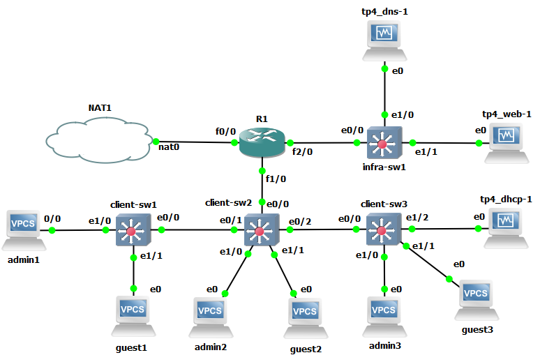
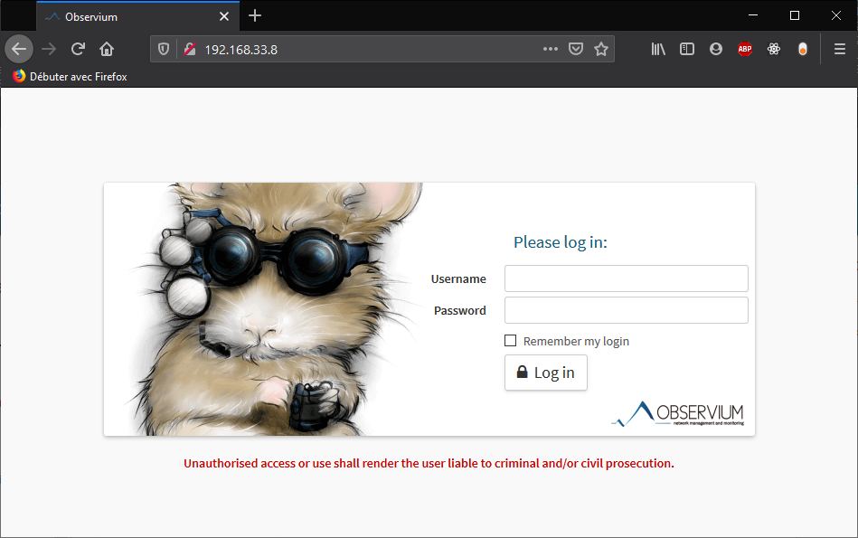
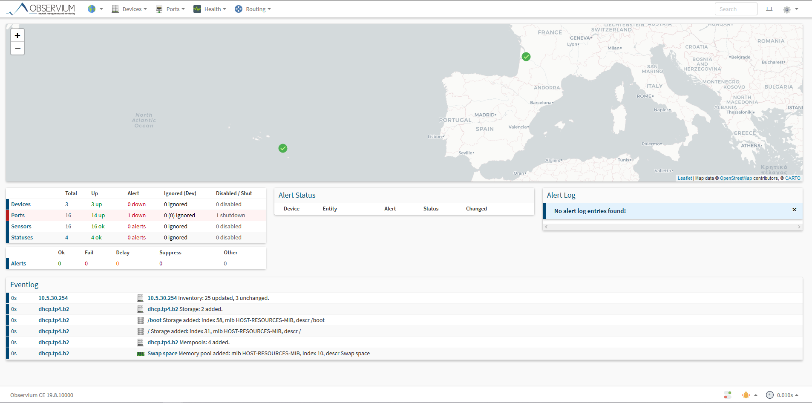

# TP4 - Buffet à volonté !

## Infrastructure de base :

Bonjour, je vais expliquer ici comment, comme tout le monde j'ai monté l'infra de base :

0. La jolie infraaa :



1. Tableau des réseaux :

| Réseaux  | Adresse        | VLan |
|----------|----------------|------|
| `admins` | `10.5.10.0/24` | 10   |
| `guests` | `10.5.20.0/24` | 20   |
| `infra`  | `10.5.30.0/24` | 30   |

2. Tableau d'adressage :

| Machine            | `admins`      | `guests`               | `infra`       |
|--------------------|---------------|------------------------|---------------|
| Routeur `r1`       | `10.5.10.254` | `10.5.20.254`          | `10.5.30.254` |
| Client `admin1`    | `10.5.10.11`  | *none*                 | *none*        |
| Client `admin2`    | `10.5.10.12`  | *none*                 | *none*        |
| Client `admin3`    | `10.5.10.13`  | *none*                 | *none*        |
| Client `guest1`    | *none*        | **DHCP**(`10.5.20.84`) | *none*        |
| Client `guest2`    | *none*        | **DHCP**(`10.5.20.86`) | *none*        |
| Client `guest3`    | *none*        | **DHCP**(`10.5.20.87`) | *none*        |
| Infra `tp4_dhcp-1` | *none*        | `10.5.20.253`          | *none*        |
| Infra `tp4_dns-1`  | *none*        | *none*                 | `10.5.30.11`  |
| Infra `tp4_web-1`  | *none*        | *none*                 | `10.5.30.12`  |

* [X] Les clients se joignent :

- Ping guest1 -> admin3 :
```
guest1> ping 10.5.10.13
84 bytes from 10.5.10.13 icmp_seq=1 ttl=63 time=29.145 ms
84 bytes from 10.5.10.13 icmp_seq=2 ttl=63 time=18.530 ms
84 bytes from 10.5.10.13 icmp_seq=3 ttl=63 time=15.374 ms
84 bytes from 10.5.10.13 icmp_seq=4 ttl=63 time=17.429 ms
84 bytes from 10.5.10.13 icmp_seq=5 ttl=63 time=13.385 ms
```

- Ping admin3 -> dns :
```
admin3> ping 10.5.30.11
84 bytes from 10.5.30.11 icmp_seq=1 ttl=63 time=17.054 ms
84 bytes from 10.5.30.11 icmp_seq=2 ttl=63 time=18.511 ms
84 bytes from 10.5.30.11 icmp_seq=3 ttl=63 time=13.400 ms
84 bytes from 10.5.30.11 icmp_seq=4 ttl=63 time=16.890 ms
84 bytes from 10.5.30.11 icmp_seq=5 ttl=63 time=18.111 ms
```

- Ping dns -> dhcp :
```
[sote@dns ~]$ ping dhcp.tp4.b2
PING dhcp.tp4.b2 (10.5.20.253) 56(84) bytes of data.
64 bytes from dhcp.tp4.b2 (10.5.20.253): icmp_seq=1 ttl=63 time=19.8 ms
64 bytes from dhcp.tp4.b2 (10.5.20.253): icmp_seq=2 ttl=63 time=12.0 ms
64 bytes from dhcp.tp4.b2 (10.5.20.253): icmp_seq=3 ttl=63 time=15.4 ms
64 bytes from dhcp.tp4.b2 (10.5.20.253): icmp_seq=4 ttl=63 time=20.7 ms
64 bytes from dhcp.tp4.b2 (10.5.20.253): icmp_seq=5 ttl=63 time=18.6 ms
^C
--- dhcp.tp4.b2 ping statistics ---
5 packets transmitted, 5 received, 0% packet loss, time 4021ms
rtt min/avg/max/mdev = 12.080/17.366/20.752/3.193 ms
```

- Ping dhcp -> guest2 :
```
[sote@dhcp ~]$ ping guest2.tp4.b2
PING guest2.tp4.b2 (10.5.20.86) 56(84) bytes of data.
64 bytes from 10.5.20.86 (10.5.20.86): icmp_seq=1 ttl=64 time=0.689 ms
64 bytes from 10.5.20.86 (10.5.20.86): icmp_seq=2 ttl=64 time=0.947 ms
64 bytes from 10.5.20.86 (10.5.20.86): icmp_seq=3 ttl=64 time=1.23 ms
64 bytes from 10.5.20.86 (10.5.20.86): icmp_seq=4 ttl=64 time=0.838 ms
64 bytes from 10.5.20.86 (10.5.20.86): icmp_seq=5 ttl=64 time=0.934 ms
^C
--- guest2.tp4.b2 ping statistics ---
5 packets transmitted, 5 received, 0% packet loss, time 4012ms
rtt min/avg/max/mdev = 0.689/0.928/1.235/0.181 ms
```

* [X] Les clients joignent l'**Internet** :

- Ping admin1 -> **Internet** :
```
admin1> ping 8.8.8.8
84 bytes from 8.8.8.8 icmp_seq=1 ttl=52 time=184.178 ms
84 bytes from 8.8.8.8 icmp_seq=2 ttl=52 time=58.416 ms
84 bytes from 8.8.8.8 icmp_seq=3 ttl=52 time=49.176 ms
84 bytes from 8.8.8.8 icmp_seq=4 ttl=52 time=45.276 ms
84 bytes from 8.8.8.8 icmp_seq=5 ttl=52 time=47.281 ms
```

- Ping guest2 -> **Internet** :
```
guest2> ping 8.8.8.8
84 bytes from 8.8.8.8 icmp_seq=1 ttl=52 time=165.795 ms
84 bytes from 8.8.8.8 icmp_seq=2 ttl=52 time=122.065 ms
84 bytes from 8.8.8.8 icmp_seq=3 ttl=52 time=232.604 ms
84 bytes from 8.8.8.8 icmp_seq=4 ttl=52 time=87.506 ms
84 bytes from 8.8.8.8 icmp_seq=5 ttl=52 time=47.394 ms
```

- Ping dhcp -> **Internet** :
```
[sote@dhcp ~]$ ping 8.8.8.8
PING 8.8.8.8 (8.8.8.8) 56(84) bytes of data.
64 bytes from 8.8.8.8: icmp_seq=1 ttl=52 time=51.5 ms
64 bytes from 8.8.8.8: icmp_seq=2 ttl=52 time=87.8 ms
64 bytes from 8.8.8.8: icmp_seq=3 ttl=52 time=98.4 ms
64 bytes from 8.8.8.8: icmp_seq=4 ttl=52 time=164 ms
64 bytes from 8.8.8.8: icmp_seq=5 ttl=52 time=165 ms
^C
--- 8.8.8.8 ping statistics ---
5 packets transmitted, 5 received, 0% packet loss, time 4009ms
rtt min/avg/max/mdev = 51.574/113.619/165.589/44.824 ms
```

- Ping webserver -> **Internet** :
```
[sote@web ~]$ ping 8.8.8.8
PING 8.8.8.8 (8.8.8.8) 56(84) bytes of data.
64 bytes from 8.8.8.8: icmp_seq=1 ttl=52 time=51.8 ms
64 bytes from 8.8.8.8: icmp_seq=2 ttl=52 time=46.2 ms
64 bytes from 8.8.8.8: icmp_seq=3 ttl=52 time=51.4 ms
64 bytes from 8.8.8.8: icmp_seq=4 ttl=52 time=43.5 ms
64 bytes from 8.8.8.8: icmp_seq=5 ttl=52 time=41.6 ms
^C
--- 8.8.8.8 ping statistics ---
5 packets transmitted, 5 received, 0% packet loss, time 4008ms
rtt min/avg/max/mdev = 41.617/46.956/51.893/4.142 ms
```

* [X] Le serveur web est joignable :

- Curl DHCP -> webserver :
```
[sote@dhcp ~]$ curl --head 10.5.30.12
HTTP/1.1 200 OK
Date: Fri, 24 Apr 2020 20:25:46 GMT
Server: Apache/2.4.6 (CentOS) PHP/7.2.30
X-Powered-By: PHP/7.2.30
Set-Cookie: OBSID=6bmgs0ceuk3giag5mllv6n831j; expires=Sat, 25-Apr-2020 20:25:46 GMT; Max-Age=86400; path=/; HttpOnly
Expires: Thu, 19 Nov 1981 08:52:00 GMT
Cache-Control: no-store, no-cache, must-revalidate
Pragma: no-cache
Set-Cookie: OBSID=6bmgs0ceuk3giag5mllv6n831j; expires=Sat, 25-Apr-2020 20:25:46 GMT; Max-Age=86400; path=/; HttpOnly
Content-Type: text/html; charset=UTF-8
```

>>> Attention spoil du sujet choisi

Teste depuis l'hôte (j'arrive pas à curl depuis les VPCs) et donc via la carte local-host de la machine:



* [X] Le serveur DNS est requêtable :

- Requête DNS guest3 -> dhcp :
```
guest3> ping dhcp
dhcp.tp4.b2 resolved to 10.5.20.253
84 bytes from 10.5.20.253 icmp_seq=1 ttl=64 time=0.628 ms
84 bytes from 10.5.20.253 icmp_seq=2 ttl=64 time=1.089 ms
84 bytes from 10.5.20.253 icmp_seq=3 ttl=64 time=0.840 ms
84 bytes from 10.5.20.253 icmp_seq=4 ttl=64 time=1.051 ms
84 bytes from 10.5.20.253 icmp_seq=5 ttl=64 time=1.157 ms
```

- Requête DNS dns -> dhcp :
```
[sote@dns ~]$ ping dhcp.tp4.b2
PING dhcp.tp4.b2 (10.5.20.253) 56(84) bytes of data.
64 bytes from dhcp.tp4.b2 (10.5.20.253): icmp_seq=1 ttl=63 time=20.2 ms
64 bytes from dhcp.tp4.b2 (10.5.20.253): icmp_seq=2 ttl=63 time=21.2 ms
64 bytes from dhcp.tp4.b2 (10.5.20.253): icmp_seq=3 ttl=63 time=18.6 ms
64 bytes from dhcp.tp4.b2 (10.5.20.253): icmp_seq=4 ttl=63 time=17.7 ms
64 bytes from dhcp.tp4.b2 (10.5.20.253): icmp_seq=5 ttl=63 time=19.3 ms
^C
--- dhcp.tp4.b2 ping statistics ---
5 packets transmitted, 5 received, 0% packet loss, time 4023ms
rtt min/avg/max/mdev = 17.709/19.448/21.286/1.243 ms
```

- Requête DNS guest1 -> guest2 :
```
guest1> ping guest2
guest2.tp4.b2 resolved to 10.5.20.86
84 bytes from 10.5.20.86 icmp_seq=1 ttl=64 time=0.470 ms
84 bytes from 10.5.20.86 icmp_seq=2 ttl=64 time=0.552 ms
84 bytes from 10.5.20.86 icmp_seq=3 ttl=64 time=0.488 ms
84 bytes from 10.5.20.86 icmp_seq=4 ttl=64 time=0.400 ms
84 bytes from 10.5.20.86 icmp_seq=5 ttl=64 time=0.346 ms
```

* [X] Le DHCP délivre les infos :

- Guest1 :
```
guest1> ip dhcp
DDORA IP 10.5.20.89/24 GW 10.5.20.254

guest1> show ip

NAME        : guest1[1]
IP/MASK     : 10.5.20.89/24
GATEWAY     : 10.5.20.254
DNS         : 10.5.30.11
DHCP SERVER : 10.5.20.253
DHCP LEASE  : 589, 600/300/525
DOMAIN NAME : tp4.b2
MAC         : 00:50:79:66:68:05
LPORT       : 20041
RHOST:PORT  : 127.0.0.1:20042
MTU:        : 1500
```

- Guest2 :
```
guest2> show ip

NAME        : guest2[1]
IP/MASK     : 10.5.20.86/24
GATEWAY     : 10.5.20.254
DNS         : 10.5.30.11
DHCP SERVER : 10.5.20.253
DHCP LEASE  : 596, 600/300/525
DOMAIN NAME : tp4.b2
MAC         : 00:50:79:66:68:02
LPORT       : 20035
RHOST:PORT  : 127.0.0.1:20036
MTU:        : 1500
```

- Guest3 :
```
guest3> show ip

NAME        : guest3[1]
IP/MASK     : 10.5.20.87/24
GATEWAY     : 10.5.20.254
DNS         : 10.5.30.11
DHCP SERVER : 10.5.20.253
DHCP LEASE  : 554, 600/300/525
DOMAIN NAME : tp4.b2
MAC         : 00:50:79:66:68:04
LPORT       : 20039
RHOST:PORT  : 127.0.0.1:20040
MTU:        : 1500
```

Pour plus de détails sur les confs, tu peux aller voir :

##### Éléments réseau :

- Configuration du routeur [ici](./confs/netElements/router.md).
- Configuration du switch infra [ici](./confs/netElements/infra_sw1.md).
- Configuration du switch client1 [ici](./confs/netElements/client_sw1.md).
- Configuration du switch client2 [ici](./confs/netElements/client_sw2.md).
- Configuration du switch client3 [ici](./confs/netElements/client_sw3.md).

##### Services (DHCP & DNS):

- DHCP : [ici](./confs/services/dhcpd.conf).
- DNS : `[/etc/named.conf](./confs/services/dns/named.conf)`, `[/var/named/tp4.b2.db](./confs/services/dns/tp4.b2.db)`, `[/var/named/20.5.10.db](./confs/services/dns/20.5.10.db)` ansi qu'ouvrir le port 53 à l'UDP (`sudo firewall-cmd --add-port=53/udp --permanent` puis `sudo firewall-cmd --reload`)

Ne pas oublier pour les services installés ci-dessus de les lancer avec `sudo systemctl start <serviceName>` (Donc ici `sudo systemctl start dhcpd` et `sudo systemctl start named` sur les machines correspondantes) et aussi ne pas oublier d'activer le service au démarrage avec `sudo systemctl enable <serviceName>` (Donc ici `sudo systemctl enable dhcpd` et `sudo systemctl enable named` sur les machines correspondantes).

## Sujet 1 : Métrologie Réseau : SNMP, monitoring & gestion de logs

> Pour toutes les commandes tapées ci-suivant, il faut avoir les droits root sur la machine (notamment pour les règles `firewall-cmd`, installations et commandes `systemctl`)

Afin de setup observium, on va d'abord setup les clients, comme ca *bim* **bam** _boum_ après on fait tout sur le serveur d'un coup d'un seul.

### 1 - Mise en place des clients

#### Les serveurs DNS et DHCP (Machine CentOS7) :

Pour pouvoir observer cette machine sur le serveur web avec ***Observium***, il faut tout d'abord lui installer `net-snmp` et `net-snmp-utils` afin de pouvoir avoir la suite d'applications permettant de manipuler le protocole `snmp` avec la commande `yum -y install net-snmp net-snmp-utils`.

Une fois ceci fait, on garde la configuration de base de snmpd dans un fichier avec `mv /etc/snmp/snmpd.conf /etc/snmp/snmpd.conf.orig` et on modifie avec `vi /etc/snmp/snmpd.conf` afin d'obtenir ce [fichier](./confs/services/snmpd.conf) de configuration. Grossièrement (et de ce que j'ai compris), on créée une "communauté" qui va nous servir d'accès à nos données selon différents droits, etc.

Ensuite, on redémarre ET active le service au démarrage avec `systemctl restart snmpd` et `systemctl enable snmpd`.

Et finallement, on ajoute un service au ***mur de feu***, et on ouvre le port nécessaire à la transmission de messages avec le protocole SNMP puis on le relance :
```
firewall-cmd --permanent --zone=public --add-service=snmp
firewall-cmd --add-port=161/udp --permanent
firewall-cmd --reload
```

On peut tester ensuite son bon fonctionnement avec la commande `snmpwalk -v 2c -c <community> -O e 127.0.0.1 | head` où dans mon cas la communauté est tp4b2, ce qui doit nous resortir :
```
[sote@dhcp ~]$ snmpwalk -v 2c -c tp4b2 -O e 127.0.0.1 | head
SNMPv2-MIB::sysDescr.0 = STRING: Linux dhcp.server 3.10.0-1062.el7.x86_64 #1 SMP Wed Aug 7 18:08:02 UTC 2019 x86_64
SNMPv2-MIB::sysObjectID.0 = OID: NET-SNMP-MIB::netSnmpAgentOIDs.10
DISMAN-EVENT-MIB::sysUpTimeInstance = Timeticks: (671408) 1:51:54.08
SNMPv2-MIB::sysContact.0 = STRING: Root <root@localhost> (configure /etc/snmp/snmp.local.conf)
SNMPv2-MIB::sysName.0 = STRING: dhcp.server
SNMPv2-MIB::sysLocation.0 = STRING: Bordeaux, France
SNMPv2-MIB::sysORLastChange.0 = Timeticks: (16) 0:00:00.16
SNMPv2-MIB::sysORID.1 = OID: SNMP-MPD-MIB::snmpMPDCompliance
SNMPv2-MIB::sysORID.2 = OID: SNMP-USER-BASED-SM-MIB::usmMIBCompliance
SNMPv2-MIB::sysORID.3 = OID: SNMP-FRAMEWORK-MIB::snmpFrameworkMIBCompliance
```

#### Routeur :

Pour que le routeur soit observable sur Observium (lol) il faut passer en configuration (toujours avec `conf t`) puis exécuter la commande `snmp-server community <communityName> RO` donc dans notre cas `snmp-server community tp4b2 RO` et enfin `exit` puis `wr` afin de sauvegarder la configuration.

### Le serveur ! (Finalement) :

Tout d'abord il faut ajouter les répos EPEL, OpenNMS et REMI puis installer le package `yum-utils`

```
yum install https://dl.fedoraproject.org/pub/epel/epel-release-latest-7.noarch.rpm
yum install http://yum.opennms.org/repofiles/opennms-repo-stable-rhel7.noarch.rpm
yum install http://rpms.remirepo.net/enterprise/remi-release-7.rpm

yum install yum-utils
```

Avec la commande `yum-config-manager` fraichement ajoutée on active le repo de REMI pour la version 7.2 de php :
```
yum-config-manager --enable remi-php72
```

Une fois fait, on update tout ca et on installe les paquets nécessaires au bon fonctionnement d'observium :
```
yum update

yum install wget.x86_64 httpd.x86_64 php.x86_64 php-opcache.x86_64 php-mysql.x86_64 php-gd.x86_64 \
            php-posix php-pear.noarch cronie.x86_64 net-snmp.x86_64 net-snmp-utils.x86_64 \
            fping.x86_64 mariadb-server.x86_64 mariadb.x86_64 MySQL-python.x86_64 rrdtool.x86_64 \
            subversion.x86_64  jwhois.x86_64 ipmitool.x86_64 graphviz.x86_64 ImageMagick.x86_64 \
            php-sodium.x86_64
```

On installe ensuite à la mano **Observium** dans `/opt`. On le télécharge et le dézippe :
```
cd /opt

wget http://www.observium.org/observium-community-latest.tar.gz
tar zxvf observium-community-latest.tar.gz
```

On va ensuite s'occuper de la base de donnée. Tout d'abord on `enable` et `start` le gestionnaire de base de données (ici MariaDB).
```
systemctl enable mariadb
systemctl start mariadb
```

On set ensuite le mot de passe pour `root` et on se connecte au gestionnaire afin de créer la base de données que nous allons utiliser (qui s'appellera `observium`) puis on donne tous les droits sur cette nouvelle base à l'utilisateur `observium` en lui donnant un mot de passe.
```
/usr/bin/mysqladmin -u root password '<mysql root password>'

mysql -u root -p
<mysql root password>
mysql> CREATE DATABASE observium DEFAULT CHARACTER SET utf8 COLLATE utf8_general_ci;
mysql> GRANT ALL PRIVILEGES ON observium.* TO 'observium'@'localhost' IDENTIFIED BY '<observium db password>';
mysql> exit;
```

On va ensuite dans le dossier dézippé `observium`, on copie le fichier `config.php.default` vers `config.php` afin d'avoir une config basique d'observium. il faut ensuite modifier ce même fichier pour remplire les informations relatives à la base de données `user`, `password`, `table`, et lance le fichier `./discovery.php -u` afin d'initialiser le schéma de la base de données
```
cd observium

cp config.php.default config.php
vi config.php

./discovery.php -u
```

On doit ensuite permettre l'utilisation de la commande `fping` à Observium en lui indiquant dans `config.php` le chemin de cette dernière, via la ligne de configuration `$config['fping'] = "<chemin_d_acces_fping>";`, ce dernier étant obtensible avec la commande `which fping`.

> Il est aussi conseillé de modifier se communauté de base (dans `config.php`) à la ligne `$config['snmp']['community'] = array("public");`, en remplacant `"public"` par le nom que vous désirez, pour moi ce sera `tp4b2`

Il faut ensuite mettre `SELINUX` à `permissive`, via la commande `setenforce 0` (mais qui redeviendra 1 après un redémarrage) ou en modifiant le fichier `/etc/selinux/config`, afin d'avoir :
```
[sote@web ~]$ cat /etc/selinux/config

# This file controls the state of SELinux on the system.
# SELINUX= can take one of these three values:
#     enforcing - SELinux security policy is enforced.
#     permissive - SELinux prints warnings instead of enforcing.
#     disabled - No SELinux policy is loaded.
SELINUX=permissive
# SELINUXTYPE= can take one of three values:
#     targeted - Targeted processes are protected,
#     minimum - Modification of targeted policy. Only selected processes are protected.
#     mls - Multi Level Security protection.
SELINUXTYPE=targeted
```

Il faut ensuite créer le dossier qui contiendra les informations des équipements (`/opt/observium/rrd`) et le dossier qui contiendra les logs (`/opt/observium/logs`), et leur donner comme propriétaire `apache:apache`
```
mkdir -p /opt/observium/rrd
chown apache:apache /opt/observium/rrd

mkdir -p /opt/observium/logs
chown apache:apache /opt/observium/logs
```

On ajoute ensuite le fichier de configuration du serveur `observium` à notre dossier de confs de Apache avec `vi /etc/httpd/conf.d/observium.conf`, ficher visible [ici](./confs/services/observium.conf).

Ensuite, on ouvre les ports nécessaires à tout ce tintouin (soit `80` pour `apache` et `161` pour le `snmp`) avec un petit `firewall-cmd --add-port=80/tcp --permanent` et un plus grand `firewall-cmd --add-port=161/udp --permanent` et enfin on `reload` le ***mur de feu*** (`firewall-cmd --reload`).
MAINTENANT, on allume tout ca avec des `enable` et des `start` dans tous, les sens (enfin juste 2 de chaque, pour `httpd` et `snmpd`).

On peut donc se aller sur la page du serveur, mais pas s'y connecter.


Pour y remédier, il suffit d'aller dans le dossier d'installation d'`observium` (toujours `/opt/observium`) et d'exécuter le script `./add_user.php` avec en argument le `username` souhaité, son `password` ainsi que son "niveau" (On évite les redites, c'est très simple [ici](https://docs.observium.org/user_levels/)), donc il est conseillé de créer en premier un admin, donc niveau 10.
```
cd /opt/observium
./adduser.php <username> <password> <level>
// ici ./adduser.php admin ###### 10
```

On peut ensuite ajouter des machines à observium, via le script `./add_device.php` comme par exemple ci-suivant :
=> Lui-même
```
[sote@web observium]$ ./add_device.php localhost tp4b2 v2c
Observium CE 19.8.10000
Add Device(s)

Try to add localhost:
Trying v2c community *** [0] ...

[...]

#####  localhost [7] completed discovery modules at 2020-04-25 18:46:22  #####

 o Discovery time       0.0092 seconds

CACHE CLEAR SET. Cache clear set.
Added device localhost (7).

Devices success: 1.
```

=> DHCP
```
[sote@web observium]$ ./add_device.php dhcp.tp4.b2 tp4b2 v2c
Observium CE 19.8.10000
Add Device(s)

Try to add dhcp.tp4.b2:
Trying v2c community *** [0] ...

[...]

#####  dhcp.tp4.b2 [8] completed discovery modules at 2020-04-25 18:48:15  #####

 o Discovery time       0.0293 seconds

CACHE CLEAR SET. Cache clear set.
Added device dhcp.tp4.b2 (8).

Devices success: 1.
```

=> Routeur R1
```
[sote@web observium]$ ./add_device.php 10.5.30.254 tp4b2 v2c
Observium CE 19.8.10000
Add Device(s)

Try to add 10.5.30.254:
Trying v2c community *** [0] ...

[...]

#####  10.5.30.254 [9] completed discovery modules at 2020-04-25 18:49:56  #####

 o Discovery time       0.019 seconds

CACHE CLEAR SET. Cache clear set.
Added device 10.5.30.254 (9).

Devices success: 1.
```

Et après, il faut popullater la base de données en récupérant toutes les informations grâce aux scripts `./discovery.php` et `./poller.php` :

```
[sote@web observium]$ ./discovery.php -h all

  ___   _                              _
 / _ \ | |__   ___   ___  _ __ __   __(_) _   _  _ __ ___
| | | || '_ \ / __| / _ \| '__|\ \ / /| || | | || '_ ` _ \
| |_| || |_) |\__ \|  __/| |    \ V / | || |_| || | | | | |
 \___/ |_.__/ |___/ \___||_|     \_/  |_| \__,_||_| |_| |_|
                     Observium Community Edition 19.8.10000
                                   http://www.observium.org

-- Database is up to date.
#####  Starting discovery run at 2020-04-25 18:52:41  #####

[...]

#####  Finished discovery run at 2020-04-25 18:52:53  #####

 o Devices Discovered   3
 o Discovery Time       12.95 secs
 o Memory usage         16MB (peak: 16MB)
 o MySQL Usage          Cell[99/0.017s] Row[114/0.018s] Rows[206/0.035s] Column[3/0s] Update[49/0.028s] Insert[5/0.004s] Delete[5/0.003s]
 o RRDTool Usage
```
```
[sote@web observium]$ ./poller.php -h all

  ___   _                              _
 / _ \ | |__   ___   ___  _ __ __   __(_) _   _  _ __ ___
| | | || '_ \ / __| / _ \| '__|\ \ / /| || | | || '_ ` _ \
| |_| || |_) |\__ \|  __/| |    \ V / | || |_| || | | | | |
 \___/ |_.__/ |___/ \___||_|     \_/  |_| \__,_||_| |_| |_|
                     Observium Community Edition 19.8.10000
                                   http://www.observium.org

#####  Starting polling run at 2020-04-25 18:54:06  #####

[...]

#####  Completed polling run at 2020-04-25 18:54:13  #####

 o Devices Polled       3
 o Poller Time          7.355 secs
 o Memory usage         16MB (peak: 16MB)
 o MySQL Usage          Insert[4/0.007s] Update[89/0.067s] Delete[3/0.002s] Cell[22/0.004s] Row[94/0.021s] Rows[131/0.026s] Col[14/0.004s]
                        (0.131s1.778%)
 o RRDTool Usage        update[237/0.359s] create[13/0.022s] (0.381s 5.182%)
 o SNMP Usage           snmpget[91/3.858s] errors[/0s] snmpwalk[61/2.634s] (6.492s 88.266%)
```

On peut donc au final aller sur notre site, et gentillement profiter de ces informations :



Je pourrais encore faire des 10 aines de screens pour montrer à quelle point c'est puissant de part les informations que SNMP collecte (ports, courbes, infos CPU, etc.).